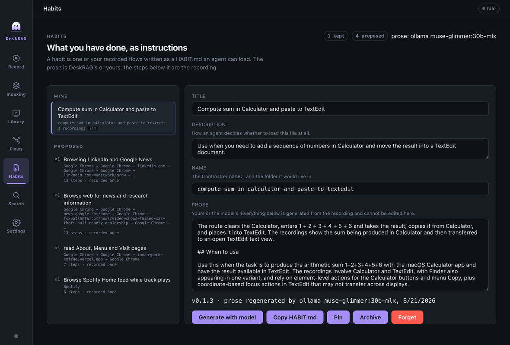

<p align="center">
  
</p>

<h1 align="center">DeskRAG</h1>

<p align="center"><strong>Local-first, multimodal desktop session memory.</strong></p>

DeskRAG captures what happens on your desktop — screen video, microphone audio,
mouse/keyboard input, active window, and the OS accessibility tree — into a searchable
"experience memory," then lets you recall past moments by:

- **semantic query** — *"that time I was debugging auth"*
- **visual example** — *"find this screen / this dialog"*
- **behavioral similarity** — *"sessions like what I'm doing now"*

It's inspired by VideoRAG and PixelRAG, with a key advantage over pure-pixel systems:
on the desktop we read real UI structure from the **accessibility tree**, giving free,
labeled region proposals — grounded bounding boxes and roles that video systems must
infer.

A recording also composes into a hierarchy — actions into tasks, tasks into phases,
phases into one named session — so you can read what a recording was *for* before
opening it.

Recordings don't stay a pile of video. Each is lifted into a **trace graph** — states
verified against the accessibility tree, edges of the actions you actually performed —
and the **Flows** screen reads it back: the routes you take repeatedly, weighted by how
often you took them, one click from any state to the moment it happened. Recording a task
twice is what reveals it as a flow, so what shows up is what you did rather than what a
model inferred.

A flow worth repeating becomes a **habit**: a `HABIT.md` an agent can load, written from
the route you actually walked. The prose is a local model's or yours; the steps beneath it
are the recording, and nothing model-written can reach them. It says what the evidence
does not cover — which steps fewer recordings took, which states can be confirmed but not
found — and it never prints what you typed unless you ask it to.

An agent can read your memory too. DeskRAG serves it over **[MCP](./docs/mcp.md)**, so a
coding assistant can ask what you actually did instead of guessing. The surface is
read-only and loopback-only, and *read-only* is enforced by a test rather than promised.

**Every model runs on your machine.** No cloud provider, no API key, no network call to
anything but a daemon on localhost — the privacy claim is structural, not a matter of how
you configured it. TypeScript throughout, strict types, pluggable local providers (Ollama,
in-process ONNX, whisper.cpp).

## DeskRAGApp

The desktop client drives the whole pipeline from a UI — record, auto-index, then play
back or search your sessions. See **[app/README.md](./app/README.md)** for setup,
permissions, and how it's wired.


<table>
<tr>
<td width="50%"><br><strong>Record</strong> — a per-signal switchboard with live permission status.</td>
<td width="50%"><br><strong>Search</strong> — hits come back as a contact sheet of keyframes.</td>
</tr>
<tr>
<td width="50%"><br><strong>Detail</strong> — why a frame came back, what matched on it, and a loupe to read the pixels.</td>
<td width="50%"><br><strong>Flows</strong> — the paths you take, and one click back to the recording.</td>
</tr>
<tr>
<td width="50%"><br><strong>Habits</strong> — a repeated flow as a HABIT.md, with the record beneath the prose.</td>
<td width="50%"></td>
</tr>
</table>

## Quick start

**macOS and Node ≥ 20.** Capture depends on avfoundation, the Swift accessibility
sidecar, and CGEvent; no other platform is stubbed.

Two prerequisites, and DeskRAG refuses to record without either: **ffmpeg 5.1+**
is the capture pipeline, and **`swiftc`** builds the `ax-dump` sidecar that reads
the device timebase.

```bash
brew install ffmpeg      # 5.1 or newer
xcode-select --install   # swiftc, for the sidecar
```

```bash
npm install         # the library (root) — Node-ABI native modules for the test suite
npm run app:install # the app (own node_modules) — postinstall builds better-sqlite3 for Electron
npm run build:ax    # the Swift sidecars — ax-dump is required to record at all
npm run app:dev     # build the library, then launch the app
```

Transcription (`brew install whisper-cpp`) and the Ollama-backed caption and
embedding providers are optional — a missing one disables exactly that feature.
See [Setup](./docs/setup.md) for permissions and [Providers](./docs/providers.md)
for what runs where.

To use the library directly instead:

```bash
npm install && npm run typecheck && npm test
```

## Documentation

| Document | What's in it |
|---|---|
| [Architecture](./docs/architecture.md) | the pipeline, the dual-store seam, vector namespacing, repo layout |
| [Setup](./docs/setup.md) | requirements, install, optional tools, macOS permissions, maintainer scripts |
| [Providers](./docs/providers.md) | what runs where, weight pinning, why every provider is local |
| [Agent access (MCP)](./docs/mcp.md) | the six read-only tools, how to connect, and the security posture |
| [Library usage](./docs/library-usage.md) | the API shape, end to end |
| [DeskRAGApp](./app/README.md) | the Electron desktop client |
| [Roadmap](./ROADMAP.md) | what isn't built yet, and where a shipped part stops short |
| [CLAUDE.md](./CLAUDE.md) | the load-bearing invariants, verified the hard way |

## License

MIT — see [LICENSE](./LICENSE).
