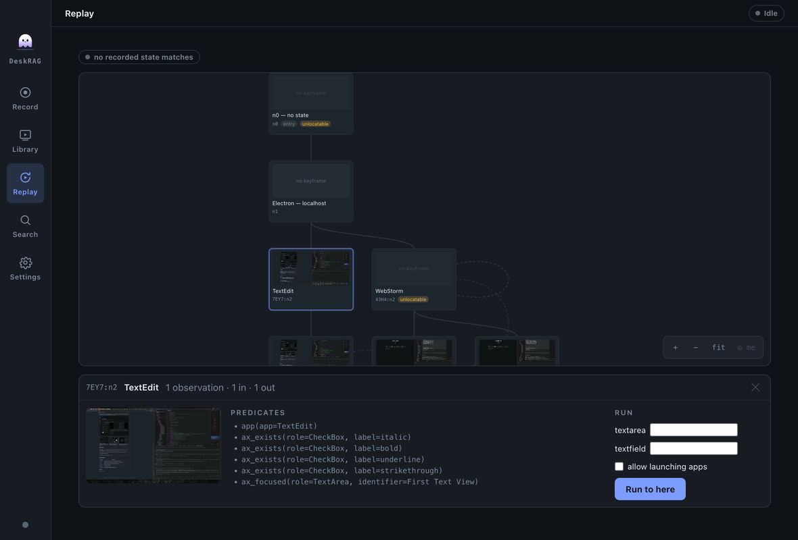

<p align="center">
  
</p>

<h1 align="center">DeskRAGApp</h1>

An Electron desktop app over the [DeskRAG](../README.md) library: pick your local
models, grant macOS permissions, toggle capture signals, record an experience, then
play it back with the index on the timeline — search your sessions as a contact
sheet of keyframes and drill into any hit, or replay a recorded task against the
live desktop.

- **electron-vite + React + TypeScript.** Five screens: Record, Library, Replay,
  Search, Settings.
- **Fully local.** Every model runs on this machine — an Ollama daemon on
  localhost, or ONNX in-process. There is no cloud provider and no API key
  anywhere in the app, so nothing you record can leave the device.
- **Auto-index after Stop.** Stopping a recording runs segment → represent
  (digest/behavior always; frame/caption/region and transcript when configured).
- **Weights download once**, verified against a pinned sha256, into
  `<userData>/DeskRAG/models/` — then everything works offline.

## Screens

### Record

Signal switchboard (screen · input · active window · microphone · accessibility
tree) with a status LED each, inline notes for a missing permission (Grant / Open
Settings) or a missing tool (`ffmpeg`, `ax-dump`), elapsed timecode, and
stage-by-stage indexing progress after Stop.


### Library

Every session you've captured, with the index put on the timeline. Keyframes become
player **chapter cues** — so the scrubber is divided at exactly the frames that were
indexed — and thumbnail images on scrub.

Below the frame is the **track rail**: fifteen lanes of what was actually captured —
input rates, focus spans, segments, keyframes, accessibility snapshots, regions, and
an audio envelope — sharing **one time axis** with the scrubber above it, so a lane
and the playhead always mean the same instant. The rail scrolls and yields space to
the frame before the page does, so how many lanes are visible follows the window. In a density lane, a gap is not a
zero: recorded silence is a flat line, while a stretch with no audio at all reads as
no coverage, which is how a dead microphone stays distinguishable from a quiet room.
A lane can also carry a warning where the data is present but unusable — keystrokes
recorded without a keyboard layout look healthy and were dropped at lift.

Sessions delete with a confirm, which removes the rows and then the blobs.

Playback has **no audio**: the screen video is video-only, so volume and mute
controls are removed rather than shown inert. Fullscreen and picture-in-picture are
removed too — this is an inspection surface, so the frame is always letterboxed
whole, never cropped.


### Search

Text query, or an image file as a visual example (needs an image model). Hits render
as a contact sheet of keyframes — timecode, wall-clock, segment digest, score, and a
highlight count.


### Detail

The frame inspector, reached from either side: **Inspect** in the player's control
bar, or by clicking a search hit. It shows the full keyframe with the segment's
digest / caption / transcript, and everything the accessibility tree captured.

Two things get drawn over the frame, and which you see depends on how you arrived.
A search hit carries **region highlights** — the boxes that matched the query.
Selecting a row in the **accessibility tree** locates that element on the frame
instead, with its label; the screenshot below is opened from the Library, so there
is no query and the AX locator is the only overlay.


### Replay

The other direction: instead of recalling a session, **re-run** one. Indexing lifts
every recording into a **trace graph** — nodes are states verified against the
accessibility tree, edges are the actions you actually performed — and every session
merges into the same graph, so recording a task a second time branches it or fills in
a variable rather than starting a disconnected chain.

**Rebuild trace graph** in the Library discards the graph and re-lifts every
recording, oldest first — needed after a change to how identity is derived, since a
stored node keeps the shape it was written with. It has to be a whole rebuild rather
than a re-lift of one session: a graph *accretes*, so folding a session into a graph
that already contains it would count it twice and inflate the very evidence used to
choose a route. Nothing is re-recorded — lifting re-reads the accessibility snapshots
and the event stream already on disk, so no video or keyframe is touched.

The screen is **two modes**, not a split. *Browse* is the graph plus a bottom drawer:
pick a node as the goal, fill any slots the route needs, and press Run. *Review* is
the route and the run log. A chip in the bar reports where you are on the graph right
now, polled live — and because looking at this screen makes DeskRAG frontmost, that
reading is of the last *other* application seen, labelled with its age.

Locating fails more often than it succeeds, so failure is a first-class view: the
drawer names the nearest recorded states, how many of their predicates held, and
exactly which ones didn't. Nodes that can never be located are marked — an identity
of only `app` is satisfied by every state in that application, and a node with no
predicates at all is vacuously true of any desktop.

**Nothing is posted from a plan you haven't reviewed at exact resolution.** Plans are
dry-run by default; arming is a separate click, per segment. A plan *stops* where
resolution stops working and discloses the rest as an unresolved remainder — bulleted,
never numbered, because a step number would be a claim of authorization. Unmet
preconditions that no action can establish are blockers and cannot be overridden;
brittleness can be, explicitly. Before acting the app hides itself and confirms it has
resigned frontmost, since the reviewer is an application too and its own window would
otherwise be sitting over the coordinates about to be clicked.



### Settings

Four groups: **Models** (text embeddings, image model, captions, Tier-4 rerank, model
directory), **Ollama** (host, embedding model, caption model), **Transcription**
(whisper.cpp binary + model), and **Capture defaults** (frame rate, keyframe max
width, audio device, chunk seconds). Two image models are offered — Nomic Vision
(fast, adds labelled region highlights) and ColSmol (late interaction, seconds per
frame); picking ColSmol warns if your keyframe width is under 2048, where its
preprocessor upscales and match quality degrades with no visible error.


Closing the window hides the app to a menu-bar tray — **recording keeps running**,
and the tray menu can start/stop it. Only Quit closes the store.

> Screenshots are generated from the built app by `npm run gen:shots` (repo root) —
> see [docs/setup.md](../docs/setup.md#maintainer-tooling).

## How it's wired

`src/main` is the *only* process that touches the library, the store, and native
modules; `src/preload` is a typed `contextBridge`; `src/renderer` (React) sees
nothing but plain serializable DTOs and calls IPC. `src/shared/types.ts` is the
contract between them — DTOs plus the IPC channel-name map — so main and preload
can't drift.

Keyframes reach the UI over a custom `deskrag://` protocol rather than as base64:
`deskrag://frame/<blobId>` buffers an image whole, and `deskrag://media/<blobId>`
streams video with `Range` → `206`, which is the only way Chromium will let a
`<video>` seek.

## Degrades gracefully

Text + behavioral search and keyframe thumbnails work with nothing but Ollama
running; every other model is optional, and a missing binary or native module
disables exactly one feature instead of breaking startup. Stopping a recording
auto-runs segment → represent, with the frame/caption/region and transcript stages
included only when their model is configured.

## Setup (dev)

From the **repo root**:

```bash
npm install            # installs the library (root) — native modules for the test suite
npm run app:install    # installs this app into app/node_modules
```

### Native modules and Electron's ABI — handled for you

This app is a **separate package with its own `app/node_modules`**, not an npm
workspace member. That's deliberate: it lets the app's Electron-ABI
`better-sqlite3` coexist with the library's Node-ABI copy at the repo root, so
neither install ever breaks the other. `npm run app:install` (i.e.
`cd app && npm install`) runs a `postinstall` that rebuilds `better-sqlite3` for
Electron — no manual step, no switching.

> `better-sqlite3` is the only ABI-fragile module (a raw Node addon). `sharp`,
> `@lancedb/lancedb`, `uiohook-napi`, and `active-win` are N-API/prebuilt
> (ABI-stable) and are never rebuilt.

### External tools (optional, per signal)

Each is best-effort — a missing one only disables its signal:

| Signal / feature | Needs |
| --- | --- |
| Screen, Microphone | `ffmpeg` on `PATH` |
| Accessibility tree | the `ax-dump` sidecar — build with `npm run build:ax` (repo root) |
| Replay | the `ax-exec` sidecar — same `npm run build:ax` |
| Transcripts | a `whisper.cpp` binary + model, set in **Settings → Transcription** |

> `ax-exec` is a **separate binary from `ax-dump`, deliberately**. `ax-dump` is
> read-only, and two of its modes need no permission at all; folding actuation into
> it would mean every accessibility read was performed by something that can also
> click. `ax-exec` refuses to start without a plan id, so a bare invocation is inert.

## Run

```bash
npm run app:dev        # from repo root: builds the library, then launches the app
```

Or, after `npm run build` (and `npm run app:install` once):

```bash
npm --prefix app run dev
npm --prefix app run typecheck   # the app's gate (renderer + node tsconfigs)
```

For a production build (`app/out/`): `npm run app:build` from the repo root.

> The app imports the library from `dist/`, not `src/` — rebuild the library
> (`npm run build`) after changing library code. `npm run app:dev` / `app:build` do
> that for you.

> Packaging: `npm run app:dist` builds and packages with `electron-builder`.
> Because the app has its own `app/node_modules` (with `electron` and the native
> deps as real dependencies), `electron-builder` resolves and rebuilds them from
> the app's own tree.

## macOS permissions

The app reads live permission status and deep-links to the right System Settings
pane. **Screen Recording** and **Accessibility** can't be granted programmatically
(grant them in System Settings, then relaunch); **Microphone** can be prompted in
app from the Record screen.

## Data

Everything lives under `<userData>/DeskRAG/` — in dev that's
`~/Library/Application Support/deskrag-app/DeskRAG/`: `app.db` (SQLite),
`lance/` (vectors), `blobs/` (keyframes + audio), `models/` (downloaded weights),
and `settings.json`. There are no secrets to store. (`<userData>` follows
Electron's app name, so a packaged build with a `productName` set will use a
different parent directory.)
