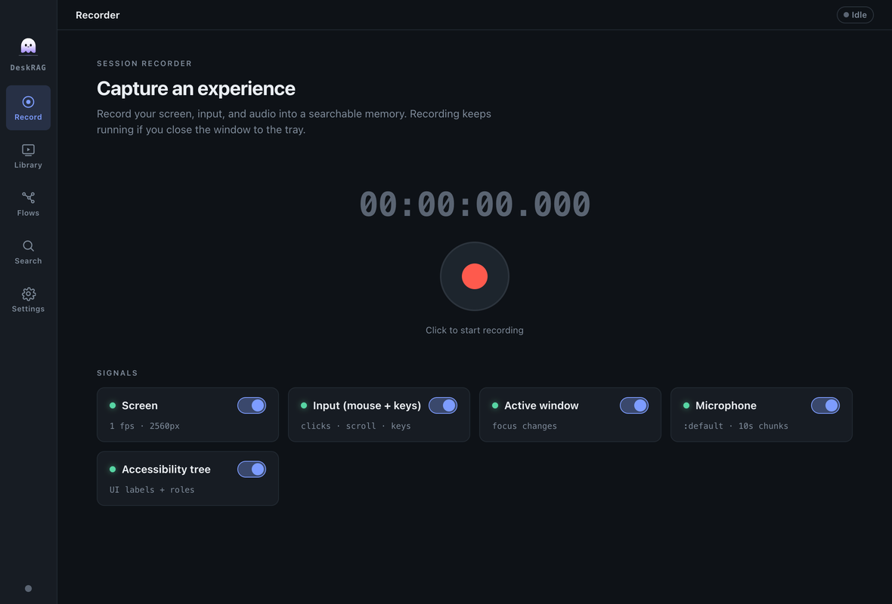
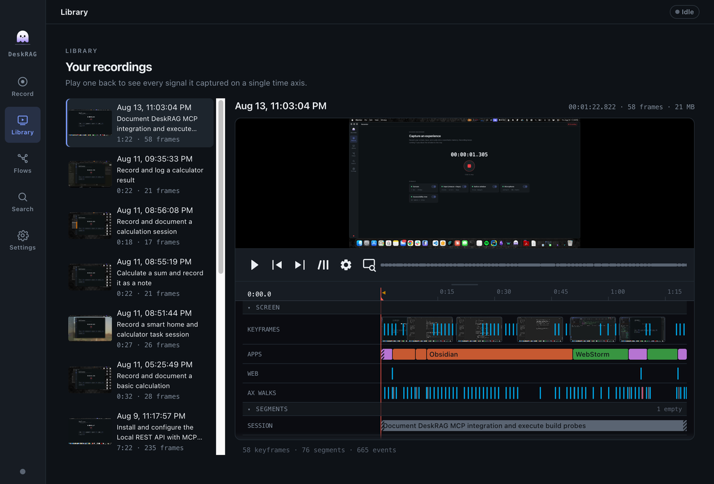
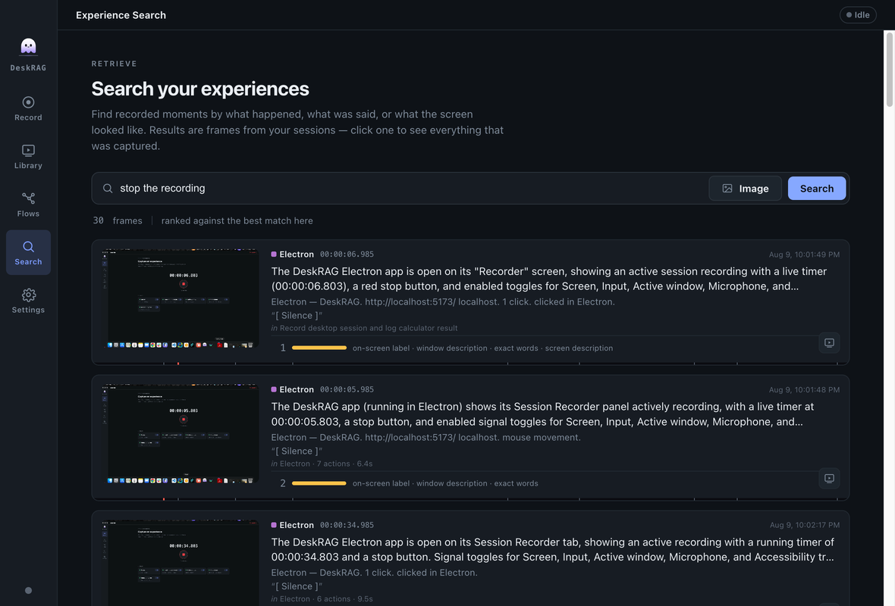
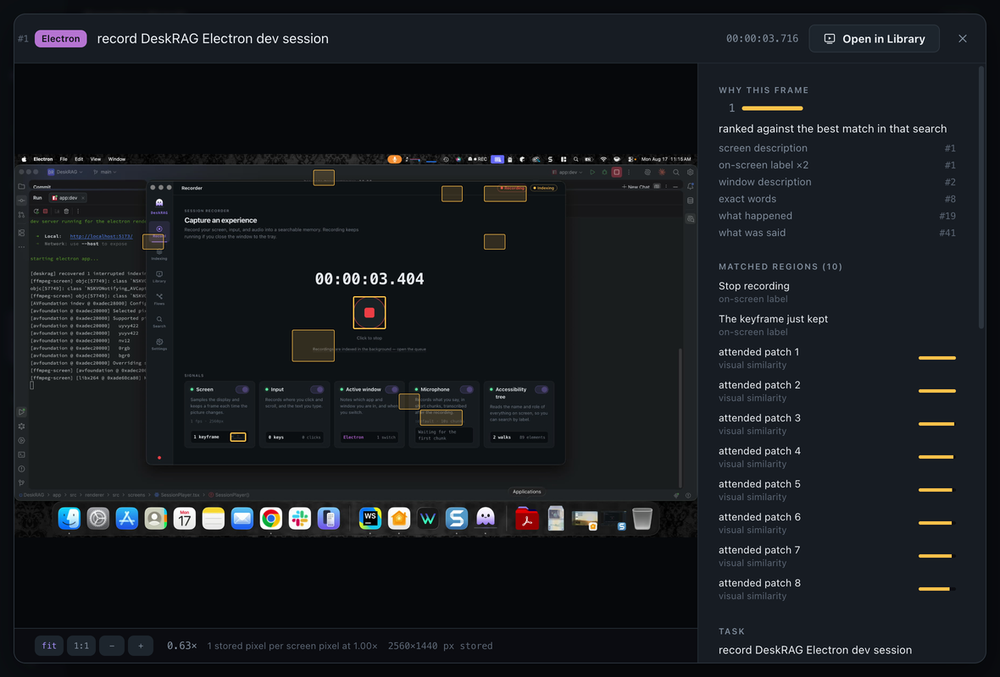
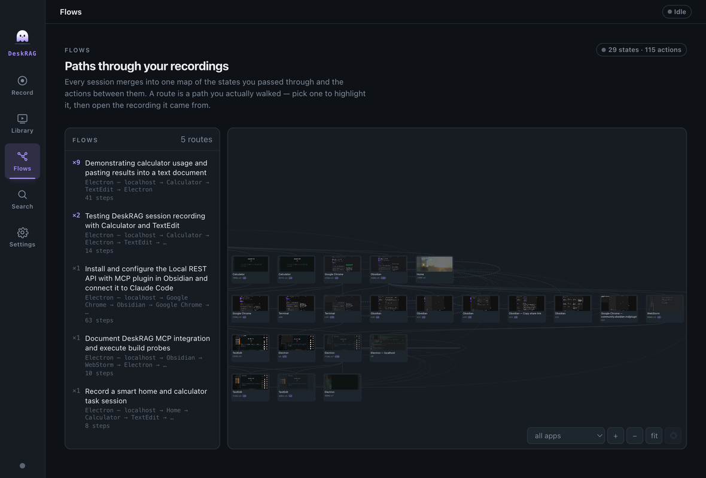
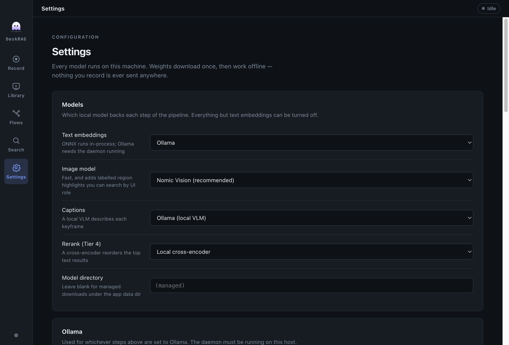
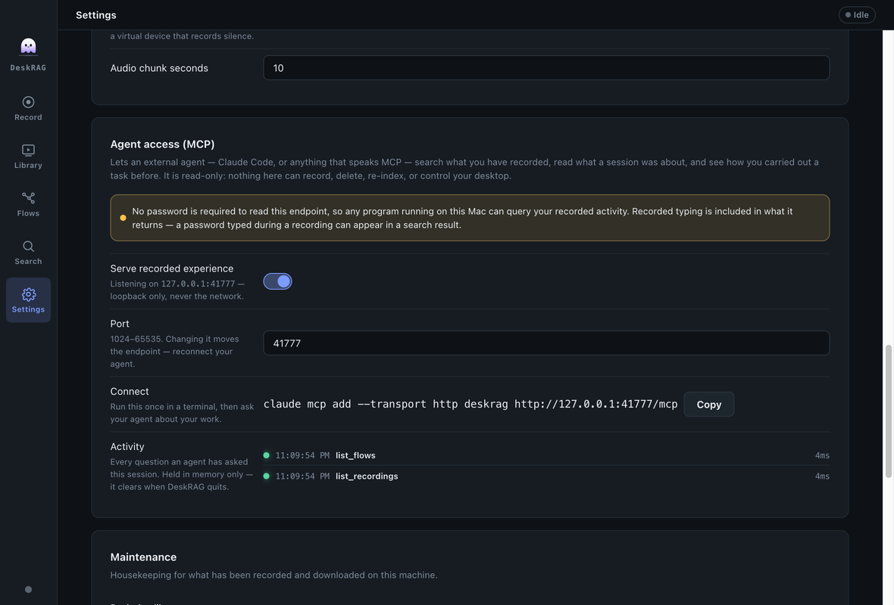

<p align="center">
  
</p>

<h1 align="center">DeskRAGApp</h1>

An Electron desktop app over the [DeskRAG](../README.md) library: pick your local
models, grant macOS permissions, toggle capture signals, record an experience, then
play it back with the index on the timeline — search your sessions as a contact
sheet of keyframes and drill into any hit, or read the graph of the flows you take
and jump from any state straight back to the moment you were in it.

- **electron-vite + React + TypeScript.** Five screens: Record, Library, Flows,
  Search, Settings.
- **Fully local.** Every model runs on this machine — an Ollama daemon on
  localhost, or ONNX in-process. There is no cloud provider and no API key
  anywhere in the app, so nothing you record can leave the device.
- **Auto-index after Stop.** Stopping a recording runs segment → represent
  (digest/behavior always; frame/caption/region and transcript when configured).
- **Weights download once**, verified against a pinned sha256, into
  `<userData>/DeskRAG/models/` — then everything works offline.

## Screens

### Record

Signal switchboard (screen · input · active window · microphone · accessibility
tree) with a status LED each, inline notes for a missing permission (Grant / Open
Settings) or a missing tool (`ffmpeg`, `ax-dump`), elapsed timecode, and
stage-by-stage indexing progress after Stop.



### Library

Every session you've captured, with the index put on the timeline. Keyframes become
player **chapter cues** — so the scrubber is divided at exactly the frames that were
indexed — and thumbnail images on scrub.

Below the frame is the **track rail**: a lane per signal actually captured — input
rates, focus spans, the composed hierarchy (session · process · task · action),
keyframes, accessibility snapshots, and an audio envelope — gathered into collapsible
bands and sharing **one time axis** with the scrubber above it, so a lane and the
playhead always mean the same instant. Drag its grip to trade rail height against the
frame; the rail yields space to the frame before the page does.

In a density lane a gap is not a zero: recorded silence is a flat line, while a
stretch with no audio at all reads as no coverage, which is how a dead microphone
stays distinguishable from a quiet room. A lane can also carry a warning where the
data is present but unusable — keystrokes recorded without a keyboard layout look
healthy and were dropped at lift.

Sessions delete with a confirm, which removes the rows and then the blobs.

Playback has **no audio**: the screen video is video-only, so volume and mute
controls are removed rather than shown inert. Fullscreen and picture-in-picture are
removed too — this is an inspection surface, so the frame is always letterboxed
whole, never cropped.



### Search

Text query, or an image file as a visual example (needs an image model). Hits render
as a contact sheet of keyframes — timecode, wall-clock, segment digest, score, and a
highlight count.

A text query is answered by **both** halves of the index: the embedding views
(digest, caption, transcript) for meaning, and a full-text index for exact terms —
a filename, an error string, a URL, a phrase you typed. The two are fused by rank,
so a result both agree on rises. The full-text half and the region-label
highlights need no model at all, so text search is fully useful before you
configure anything.

A miss tells you *which* kind it is: "no matches" is different from "these
recordings were indexed by another embedding model" and from "segments matched but
no keyframe is linked to them", which is an index problem with a specific fix
(below).



### Detail

The frame inspector, reached from either side: **Inspect** in the player's control
bar, or by clicking a search hit. It shows the full keyframe with the segment's
digest / caption / transcript, and everything the accessibility tree captured.

Two things get drawn over the frame, and which you see depends on how you arrived.
A search hit carries **region highlights** — the boxes that matched the query.
Selecting a row in the **accessibility tree** locates that element on the frame
instead, with its label; the screenshot below is opened from the Library, so there
is no query and the AX locator is the only overlay.



### Flows

The other direction: instead of recalling one session, see the **shape of what you
do**. Indexing lifts every recording into a **trace graph** — nodes are states
verified against the accessibility tree, edges are the actions you actually performed
— and every session merges into the same graph, so recording a task a second time
branches it or fills in a variable rather than starting a disconnected chain.

The left column lists your **flows**, most-walked first. A flow is one recording's own
path through the graph, keyed by the states it passed through: record the same task
five times and it is one row reading `×5`, not five rows. It is deliberately **not** an
enumeration of paths through the graph — a merged graph composes routes nobody ever
walked, and presenting those as your common flows would be a fabrication. So a graph
with no provenance shows no flows at all, and says why — a graph built before
provenance was captured needs **Settings → Rebuild trace graph** once.

Selecting a flow frames it on the canvas and dims everything else. Wires are weighted
by how many recordings walked them, so a worn path looks worn. Clicking a wire opens
the actions it recorded, in words, with the values typed into each slot — two different
values is a **discovered variable**, which is what recording a task twice produces.

**Every state and every action links back to its recordings.** That is the point of the
screen: the drawer lists each session that observed it with the timecode, and clicking
one opens the Library at exactly that moment. `observations` and the number of links can
legitimately disagree — a recording you deleted leaves the count it contributed — and
the drawer says so rather than showing a quietly short list.

Nodes that cannot be told apart are marked, because it explains why a graph looks
redundant: an identity of only `app` is satisfied by every state in that application,
and a node with no predicates at all is vacuously true of any desktop.

**This screen reads and never acts.** The library can also execute this graph, but
none of that is wired to the app — DeskRAGApp never starts a process capable of
clicking. See [ROADMAP.md](../ROADMAP.md).



### Settings

**Models** (text embeddings, image model, captions, Tier-4 rerank, model directory),
**Ollama** (host, embedding model, caption model), **Transcription** (whisper.cpp
binary + model), **Capture defaults** (frame rate, keyframe max width, audio device,
chunk seconds), and **Maintenance**.

The image model is **ColModernVBERT**, or **None**. It is late interaction, so one
model embeds images and text into one space — which is what lets a typed query
reach frames directly — at seconds per frame and patch-granular matching.
Picking it warns if your keyframe width is under 2048, where its preprocessor
upscales and match quality degrades with no visible error.

An install that had the removed `nomic` or `colsmol` selected is migrated to
ColModernVBERT on launch and told so: those frames are indexed in a vector space
nothing can query, their Lance tables are dropped, and a re-index rebuilds them.



**Maintenance** holds the two rebuilds, and neither re-records anything.

**Re-index library** discards everything indexing derived from every recording —
segments, regions, captions, transcripts, the composed hierarchy, the search index
and every vector — and builds it all again from the raw capture, which is never
touched. What a recording is *findable by* is decided by the code that indexed it,
so anything recorded before the digest carried window titles, typed text and clicked
labels stays unfindable by them until this runs — and a recording indexed with no
image provider has no frame↔segment links at all, which makes text search return
nothing for it.

It asks first, because it rebuilds with the providers configured *now*. Re-index
with no captioner and every caption is gone for good; with no whisper binary, every
transcript. The pixels and the audio are still on disk, so a later run that has the
provider can produce them again — but this run will not. It also runs the model
stages over the whole library, so it takes minutes to hours rather than seconds.

**Rebuild trace graph** discards the graph and re-lifts every recording, oldest
first — needed after a change to how identity is derived, since a stored node keeps
the shape it was written with, and required once for a graph built before provenance
was captured. It has to be a whole rebuild rather than a re-lift of one session: a
graph *accretes*, so folding in a session it already contains would count it twice
and inflate the very evidence used to weight a route. Lifting re-reads the
accessibility snapshots and the event stream already on disk; no video or keyframe is
touched.

A further group, **Agent access (MCP)**, serves your recorded experience to an
external agent over a loopback HTTP endpoint (`127.0.0.1:41777` by default) and
carries a ready-made `claude mcp add` command. It is read-only — a test asserts
nothing on that surface can record, delete, re-index, or reach the executor — and
the pane shows every question an agent has asked, live. That log is the gate:
the endpoint has no password by design, so the pane states plainly that any local
program can read the index and that recorded typing is included in what it
returns. See **[docs/mcp.md](../docs/mcp.md)**.



Closing the window hides the app to a menu-bar tray — **recording keeps running**,
and the tray menu can start/stop it. Only Quit closes the store.

> Screenshots are generated from the built app by `npm run gen:shots` (repo root) —
> see [docs/setup.md](../docs/setup.md#maintainer-tooling).

## How it's wired

`src/main` is the *only* process that touches the library, the store, and native
modules; `src/preload` is a typed `contextBridge`; `src/renderer` (React) sees
nothing but plain serializable DTOs and calls IPC. `src/shared/types.ts` is the
contract between them — DTOs plus the IPC channel-name map — so main and preload
can't drift.

Keyframes reach the UI over a custom `deskrag://` protocol rather than as base64:
`deskrag://frame/<blobId>` buffers an image whole, and `deskrag://media/<blobId>`
streams video with `Range` → `206`, which is the only way Chromium will let a
`<video>` seek.

## Degrades gracefully

Text + behavioral search and keyframe thumbnails work with nothing but Ollama
running; every other model is optional, and a missing binary or native module
disables exactly one feature instead of breaking startup. Stopping a recording
auto-runs segment → represent, with the frame/caption/region and transcript stages
included only when their model is configured.

These stages run **regardless of configuration**, because they need no model and
search does not work without them: segmenting, linking keyframes to segments,
linking accessibility walks to frames, region proposal, the digest and behavioral
vector, composing the hierarchy, the text index, and the trace graph. The
provider-gated stages only ever add to what those produce — a summarizer, for
instance, gives the composed levels real prose instead of a templated rollup, but
the tree is built either way.

## Setup (dev)

From the **repo root**:

```bash
npm install            # installs the library (root) — native modules for the test suite
npm run app:install    # installs this app into app/node_modules
```

### Native modules and Electron's ABI — handled for you

This app is a **separate package with its own `app/node_modules`**, not an npm
workspace member. That's deliberate: it lets the app's Electron-ABI
`better-sqlite3` coexist with the library's Node-ABI copy at the repo root, so
neither install ever breaks the other. `npm run app:install` (i.e.
`cd app && npm install`) runs a `postinstall` that rebuilds `better-sqlite3` for
Electron — no manual step, no switching.

> `better-sqlite3` is the only ABI-fragile module (a raw Node addon). `sharp`,
> `@lancedb/lancedb`, `uiohook-napi`, and `active-win` are N-API/prebuilt
> (ABI-stable) and are never rebuilt.

### External tools (optional, per signal)

Each is best-effort — a missing one only disables its signal:

| Signal / feature | Needs |
| --- | --- |
| Screen, Microphone | `ffmpeg` on `PATH` |
| Accessibility tree | the `ax-dump` sidecar — build with `npm run build:ax` (repo root) |
| Transcripts | a `whisper.cpp` binary + model, set in **Settings → Transcription** |

> The app needs **only `ax-dump`**, which is read-only and two of whose modes need no
> permission at all. `npm run build:ax` also builds `ax-exec`, the binary that can
> click — that one belongs to the library's executor and the read-only probe script,
> and nothing in DeskRAGApp spawns it.

## Run

```bash
npm run app:dev        # from repo root: builds the library, then launches the app
```

Or, after `npm run build` (and `npm run app:install` once):

```bash
npm --prefix app run dev
npm --prefix app run typecheck   # the app's gate (renderer + node tsconfigs)
```

For a production build (`app/out/`): `npm run app:build` from the repo root.

> The app imports the library from `dist/`, not `src/` — rebuild the library
> (`npm run build`) after changing library code. `npm run app:dev` / `app:build` do
> that for you.

> Packaging: `npm run app:dist` builds and packages with `electron-builder`.
> Because the app has its own `app/node_modules` (with `electron` and the native
> deps as real dependencies), `electron-builder` resolves and rebuilds them from
> the app's own tree.

## macOS permissions

The app reads live permission status and deep-links to the right System Settings
pane. **Screen Recording** and **Accessibility** can't be granted programmatically
(grant them in System Settings, then relaunch); **Microphone** can be prompted in
app from the Record screen.

## Data

Everything lives under `<userData>/DeskRAG/` — in dev that's
`~/Library/Application Support/deskrag-app/DeskRAG/`: `app.db` (SQLite),
`lance/` (vectors), `blobs/` (keyframes + audio), `models/` (downloaded weights),
and `settings.json`. There are no secrets to store. (`<userData>` follows
Electron's app name, so a packaged build with a `productName` set will use a
different parent directory.)
